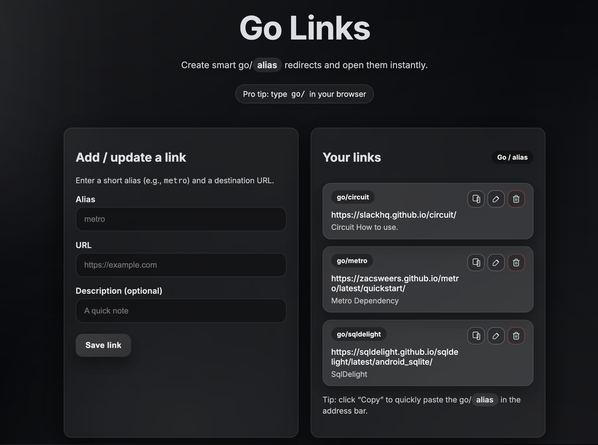

# Lets Go

A lightweight local Go Links manager that lets you create short `go/alias` redirects via a browser UI.

## Screenshot


## Demo
https://github.com/user-attachments/assets/939b77ce-abd6-4e57-912d-41915b0f488d


## Getting started

1. Install dependencies:

```bash
npm install
```

2. Start the server:

```bash
npm run dev
```

3. Open the UI:

- Visit `http://localhost:3000` to manage links.

### Start everything with one command

Run the all-in-one helper script to:

- Ensure `go` is mapped in `/etc/hosts`
- Pick a free port (starts at 3000)
- Start the server (if not already running)
- Enable port forwarding (macOS) so `http://go/` works

```bash
./scripts/run.sh
```

It will print the URL you can use to manage links and the URL you can use in the browser.


### Add this to access the dashboard as go/go


---

### Running on port 80 (optional)

If you prefer to run the server directly on port 80 (requires elevated privileges), you can still use:

```bash
sudo PORT=80 npm start
```

Once running on port 80, you can use:

```
http://go/metro
```
If you do this make sure your `go/go` link points to "localhost" and not localhost:3000.

---

If you want to stop port forwarding (macOS only):

```bash
sudo ./scripts/disable-go-port-forward.sh
```

## Data storage

Links are stored in `data/links.json`. You can backup or inspect this file as needed.
